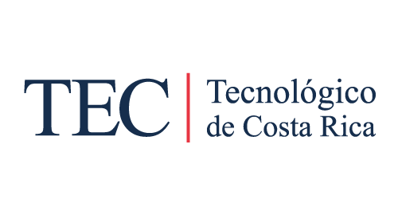

Content created by Arturo throughout his path in the TEC's Computer Engineering career.
=====================
  
Projects, tasks and other documents created in courses of the TEC Computer Engineering Degree. Once a course is finished or while it is being completed, the content will be updated.

## Getting Started
You just have to choose the course folder you want and inside you will find the material.

## License
This project is licensed under the MIT License - see the [LICENSE.md](LICENSE.md) file for details.

## Disclaimer
This repo is of my property and although there are other collaborators of the Costa Rica Institute of Technology, it don't act out as an official site of information for this institution neither states his opinion or his peers.
